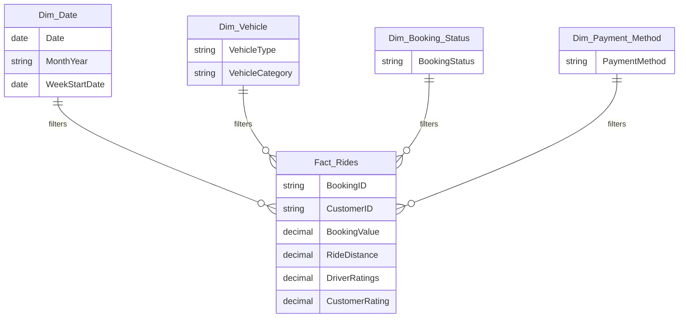

# NCR Ride Booking Executive Analytics Dashboard

Power BI course assignment — *August Assignment*

A five-page Power BI report that answers one question: of 150,000 ride bookings
placed across Delhi NCR in 2024, why did only 62% become completed rides?

The report covers demand, fleet mix, revenue, cancellations and service quality.
It is built as a **PBIP project** (Power BI enhanced report format), so the
semantic model and the report definition are plain folders of JSON and TMDL
rather than a single binary `.pbix`.

---

## Contents

- [Dataset](#dataset)
- [Data model](#data-model)
- [Measures and calculated columns](#measures-and-calculated-columns)
- [Report pages](#report-pages)
- [Interactivity](#interactivity)
- [Design system](#design-system)
- [Key findings](#key-findings)
- [Files in this folder](#files-in-this-folder)
- [Opening and working with the project](#opening-and-working-with-the-project)
- [Known limitations](#known-limitations)

---

## Dataset

`ncr_ride_bookings.csv` — 150,000 rows, one per booking, 1 January to
30 December 2024.

| Column group | Columns |
| --- | --- |
| Booking | Date, Time, Booking ID, Booking Status, Customer ID |
| Service | Vehicle Type, Pickup Location, Drop Location |
| Timing | Avg VTAT (vehicle turnaround), Avg CTAT (customer turnaround) |
| Cancellation | Cancelled Rides by Customer, Reason for cancelling by Customer, Cancelled Rides by Driver, Driver Cancellation Reason |
| Incomplete | Incomplete Rides, Incomplete Rides Reason |
| Commercial | Booking Value, Ride Distance, Payment Method |
| Quality | Driver Ratings, Customer Rating |

Two shapes in the data drive most of the modelling decisions:

1. **Ratings, booking value and ride distance exist only for rides that ran.**
   Any average over them has to be scoped to completed rides rather than all
   bookings.
2. **Each cancellation-reason column is populated only for its own status.**
   The other 139,500 rows read as blank, so the reason charts filter those out
   explicitly.

---

## Data model

A star schema: one fact table carrying the 150,000 booking rows, four dimension
tables filtering into it, and no relationships between dimensions.



| Table | Rows | Role |
| --- | --- | --- |
| `Fact_Rides` | 150,000 | Fact table — all measures live here |
| `Dim_Date` | 365 | Marked as the date table |
| `Dim_Vehicle` | 7 | Vehicle Type, Vehicle Category |
| `Dim_Booking_Status` | 5 | Booking Status |
| `Dim_Payment_Method` | 5 | Payment Method |
| `Ride Volume Granularity` | 3 | DAX field parameter — **disconnected**, no relationship |

Every relationship is one-to-many and single direction, filtering from the
dimension into the fact table. `Dim_Date` is marked as the date table, which is
what lets the rolling 7-day average and any time intelligence work.

---

## Measures and calculated columns

All measures live on `Fact_Rides`.

| Group | Measures |
| --- | --- |
| Volume | Total Bookings, Completed Rides, Completion Rate, Rides Rolling 7-Day Avg |
| Revenue | Total Booking Value, Average Completed Ride Value, Revenue per Customer |
| Distance | Total Ride Distance, Completed Ride Distance, Distance Share %, Average Ride Distance |
| Cancellation | Cancelled by Customer, Cancelled by Driver, Customer Cancellation Rate, Driver Cancellation Rate, No Driver Found, Incomplete Rides |
| Quality | Average Driver Rating, Average Customer Rating, Rating Gap, Rated Rides, Customer Rated Rides |

**Calculated columns**

- `Driver Rating Band` / `Customer Rating Band` — TRUNC-based buckets turning a
  continuous rating into 3★ / 4★ / 5★.
- `Customer Value Rank` — RANKX, used by the customer leaderboard.

**Dynamic insight measures** — Overall Performance Insight, Highest Cancellation
Vehicle Insight, Rating Distribution Insight. These use `ADDCOLUMNS` with `TOPN`
and `MAXX` to write a sentence that updates as filters change, so each page
carries a written takeaway rather than only charts.

### Two rules that matter more than the formulas

**Rates use the right denominator.** Customer Cancellation Rate is customer
cancellations over *all* bookings (7.0%), not over cancellations alone. Mixing
those two denominators is the easiest way to misread this dataset.

**Averages are scoped to completed rides.** Average Completed Ride Value is
₹508.18 across the 93,000 rides that ran. Spreading the same revenue across all
150,000 bookings would understate it by a third.

---

## Report pages

Five pages, each answering one question. Canvas is 1920 × 1080 throughout.

### 1 · Overall Performance — *Is demand healthy, and does it convert?*

Six KPI cards (bookings, completed, completion rate, booking value, both
ratings), a line chart of daily volume against a rolling 7-day average, a
booking-status doughnut, a written insight strip, and the four slicers that
drive the whole report.

### 2 · Vehicle Type Analysis — *Which vehicle types carry the business?*

A hero bar chart of the top five types by total ride distance, supporting
columns for bookings, revenue and ratings by type, and a detail table with
distance share and completion rate per type.

### 3 · Revenue Analytics — *Where does the money come from?*

Five KPI cards, revenue by payment method split by booking status, a top-five
customer leaderboard ranked by total booking value, and a distance-band
distribution of completed rides.

### 4 · Cancellation Intelligence — *Why do rides fail?*

Six KPI cards for each failure mode, two reason breakdowns (customer-initiated
and driver-initiated), cancellation rate by vehicle type, a daily cancellation
trend, and a dynamic insight naming the worst-performing vehicle type.

### 5 · Rating & Quality Assessment — *How good is the service?*

Four KPI cards including the driver-to-customer rating gap, a driver-versus-
customer comparison by vehicle type, and two rating-band distributions showing
where the scores actually cluster.

---

## Interactivity

Four slicers — **Date, Vehicle Type, Booking Status, Payment Method** — sit on
the Overall Performance page and are the only place a filter is set.

They are configured with **Sync slicers**: *Sync* is ticked for all five pages
so a selection filters the entire report, while *Visible* is ticked only for
page 1. Pages 2–5 therefore inherit the filter without carrying duplicate
controls, which is why the slicers do not appear on them.

Three visual-level filters are also applied:

| Page | Visual | Filter |
| --- | --- | --- |
| Vehicle Type Analysis | Hero bar chart | Top N = 5 by Total Ride Distance |
| Revenue Analytics | Customer leaderboard | Top N = 5 by Total Booking Value |
| Cancellation Intelligence | Both reason breakdowns | Reason `is not (Blank)` |

The blank exclusion is written as *is not (Blank)* rather than as a tick-list of
the current reason values. That way any new reason appearing in future data is
included automatically instead of being silently dropped.

---

## Design system

The report runs on a custom theme, **NCR Ride Booking – Vivid Executive**,
registered inside the report at `StaticResources/RegisteredResources/`.

| Role | Value |
| --- | --- |
| Data colours | Indigo `#4B3FCB`, coral `#FF5A5F`, amber `#FFB627`, teal `#00B8A9`, magenta `#E4467E`, sky `#3DA9FC`, lime `#8BC34A`, slate purple `#7B6FE0` |
| Page background | `#FDFCFF` |
| Foreground / text | `#1B1140` |
| Good / neutral / bad | `#1FAE6E` / `#FFB627` / `#E63950` |
| Type | Segoe UI, Segoe UI Semibold for titles and KPI values |

The theme sets visual styles for cards, donuts, bars, lines, tables, multi-row
cards and slicers, so formatting is inherited rather than set per visual. Table
headers carry the indigo as a solid band with white type.

The theme replaced an earlier teal-and-ink palette. It was built by taking the
structure of the working theme file and changing only colour values — same keys,
same nesting — which is why it imported without the schema errors a hand-written
theme tends to produce.

---

## Key findings

The constraint is **supply reliability, not demand**. Monthly bookings vary only
between 11,927 and 12,897 and weekday volume varies under 2%, so the 38% that
never converts is structural rather than seasonal.

| Metric | Value |
| --- | --- |
| Total bookings | 150,000 |
| Completed rides | 93,000 (62.0%) |
| Cancelled by driver | 27,000 (18.0%) |
| Cancelled by customer | 10,500 (7.0%) |
| No driver found | 10,500 (7.0%) |
| Incomplete | 9,000 (6.0%) |
| Total booking value | ₹51.85M |
| Average completed ride | ₹508.18 over 26.0 km |
| Driver / customer rating | 4.23 / 4.40 |

### ₹24.4M of demand never converts

48,000 cancelled or unfulfilled bookings at the average ride value — a 51.6%
uplift on the ₹47.3M actually earned. Each percentage point of completion rate
is worth about ₹762,000.

### 28.1% of all bookings fail for driver-attributable reasons

Beyond the driver cancellations and unfulfilled requests, another 4,630
*customer* cancellations carry driver-caused reasons — "driver is not moving
towards pickup" and "driver asked to cancel" together make up 44.1% of the
customer-cancellation mix. Those are miscategorised in the reason codes.

### There is almost no repeat business

148,788 distinct customers produced 150,000 bookings; only 1,206 people (0.81%)
ever booked twice, and nobody booked more than three times. The customer
leaderboard is therefore a list of single high-value trips, not loyal customers.

**Supporting notes.** Completion rate is nearly identical across all seven
vehicle types (61.4%–62.6%), which points at a platform-level cause rather than
a fleet one; and 75.1% of revenue already settles digitally, with UPI alone at
₹23.3M.

---

## Files in this folder

| File or folder | What it is |
| --- | --- |
| `NCR Ride Booking Executive Analytics Dashboard.pbip` | The project entry point — **open this one** |
| `NCR Ride Booking Executive Analytics Dashboard.SemanticModel/` | Tables, relationships, measures and calculated columns (TMDL) |
| `NCR Ride Booking Executive Analytics Dashboard.Report/` | Report definition — see below |
| `ncr_ride_bookings.csv` | Source data, 150,000 rows |
| `NCR_Executive_Theme.json` | Theme file |
| `NCR Ride Booking Data Blueprint.pdf` | Dataset and field reference |
| `Ride Booking Measure Layer.pdf` | Measure documentation |
| `NCR Ride Booking - Executive Analytics Review.pptx` / `.pdf` | Ten-slide executive deck |

Inside the report folder:

```
NCR Ride Booking Executive Analytics Dashboard.Report/
├── definition/
│   ├── report.json            theme registration, report-level settings
│   ├── version.json
│   └── pages/
│       ├── pages.json         page order and active page
│       └── <pageId>/
│           ├── page.json      name, display name, 1920×1080 canvas
│           └── visuals/
│               └── <visualId>/visual.json
├── StaticResources/
│   └── RegisteredResources/   the theme file as Power BI registered it
├── .platform
└── definition.pbir
```

---

## Opening and working with the project

Open `NCR Ride Booking Executive Analytics Dashboard.pbip` in Power BI Desktop.
The `.Report` and `.SemanticModel` folders beside it must stay where they are —
the `.pbip` is only a pointer to them.

If the data path needs repointing, use **Transform data → Data source settings**
and aim the query at wherever `ncr_ride_bookings.csv` sits.

A few things worth knowing before editing:

- **Replacing the report.** Swapping the whole `.Report` folder replaces every
  page at once. Keep a copy of the working folder before doing it — a malformed
  `visual.json` fails the *entire* report, not just the page it is on, and the
  error message does not say which file is at fault.
- **Edit visual JSON only with Desktop closed.** Desktop holds the report
  definition in memory and rewrites it on save, so edits made while it is open
  are silently overwritten.
- **Arrow keys move one visual, not a selection.** Multi-selecting visuals and
  nudging does nothing; repositioning several at once means editing their
  `position` blocks in the `visual.json` files.
- **Page size is fixed at 1920 × 1080.** A visual whose `y + height` exceeds
  1080 is cut off rather than scaled, so check the bottom edge after moving
  anything.

---

## Known limitations

**Title banners are on page 1 only.** A "Ride Booking — Overall Performance"
banner was added to the first page but currently overlaps the KPI card row,
because page content starts at `y=20` and the banner needs the top 72px. Giving
all five pages a banner means shifting every visual down about 68px and trimming
the few that would then run past the bottom edge — a change to roughly 66
`visual.json` files that was prepared but not applied.

**The Daily / Weekly / Monthly toggle is not wired up.** A
`Ride Volume Granularity` field parameter exists in the model, but the line chart
on page 1 is bound to `Dim_Date[Date]` directly. Field parameters only perform
the field swap when the parameter is bound through Desktop's own drag-and-drop;
placed by hand in JSON, the column renders as three literal text labels instead.
Wiring it up means dragging the parameter onto the chart's axis in Desktop.

**Average Ride Distance has two readings.** The dashboard KPI shows 24.64 km,
which averages across every row carrying a distance. The deck uses 26.0 km, the
average across completed rides only. Both are correct for what they measure; the
deck's version is the one to quote when talking about a typical ride.

**Ratings exist only for completed rides.** All 93,000 rated rides are completed
ones, so rating figures say nothing about the experience of a cancelled
booking — which is where most of the dissatisfaction in this dataset probably
sits.

**No repeat-customer analysis is possible beyond the count.** With a 0.81%
repeat rate and a maximum of three bookings per customer, cohort or retention
analysis has nothing to work with.
